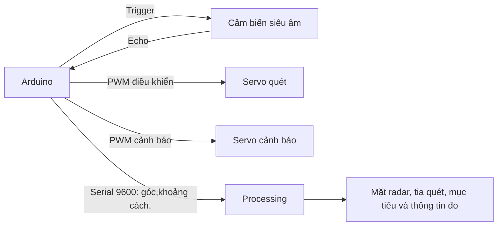

# Arduino Ultrasonic Radar

Mô hình radar siêu âm dùng Arduino để quét góc và đo khoảng cách vật cản, sau đó gửi dữ liệu đến ứng dụng Processing để hiển thị trực quan trên máy tính.

## Mục lục

- [Giới thiệu](#giới-thiệu)
- [Tính năng](#tính-năng)
- [Phần cứng và phần mềm](#phần-cứng-và-phần-mềm)
- [Cấu trúc dự án](#cấu-trúc-dự-án)
- [Bắt đầu nhanh](#bắt-đầu-nhanh)
- [Cấu hình](#cấu-hình)
- [Kiến trúc và luồng dữ liệu](#kiến-trúc-và-luồng-dữ-liệu)
- [Kiểm thử](#kiểm-thử)
- [Giới hạn hiện tại](#giới-hạn-hiện-tại)
- [Lộ trình](#lộ-trình)
- [Đóng góp](#đóng-góp)
- [Bảo mật và hỗ trợ](#bảo-mật-và-hỗ-trợ)
- [Giấy phép](#giấy-phép)
- [Ghi nhận](#ghi-nhận)

## Giới thiệu

Dự án là mô hình học tập/trình diễn về đo khoảng cách bằng siêu âm và trực quan hóa dữ liệu cảm biến. Một servo xoay cảm biến qua lại trong vùng 15°–165°. Với mỗi góc, Arduino đọc khoảng cách, điều khiển servo cảnh báo và gửi mẫu đo qua cổng Serial. Ứng dụng Processing nhận các mẫu này để vẽ mặt radar, tia quét, dấu vị trí vật cản và thông tin góc/khoảng cách.

Dự án phù hợp cho người mới tìm hiểu Arduino, cảm biến siêu âm, servo, giao tiếp nối tiếp và đồ họa Processing. Đây là mô hình minh họa trong phạm vi gần, **không phải thiết bị radar chuyên dụng hoặc thiết bị an toàn**.

Kho mã hiện chỉ có firmware và sketch Processing; chưa có ảnh chụp demo, tài liệu sơ đồ mạch, hệ thống phát hành hay kênh cộng đồng được cấu hình.

## Tính năng

- Quét qua lại từ 15° đến 165° bằng servo.
- Đo khoảng cách bằng cảm biến siêu âm tại mỗi vị trí.
- Đưa servo cảnh báo đến 90° khi Arduino đo được vật cản trong phạm vi 30 cm; đưa về 0° khi không phát hiện trong phạm vi đó.
- Gửi góc và khoảng cách qua Serial ở tốc độ 9600 baud.
- Hiển thị mặt radar, tia quét, dấu mục tiêu có hiệu ứng mờ và trạng thái khoảng cách trong Processing.

## Phần cứng và phần mềm

### Phần cứng

Mã nguồn sử dụng các chân như sau. Loại cảm biến và board cụ thể chưa được ghi trong kho mã; bảng dưới mô tả cách nối dự kiến, cần đối chiếu với linh kiện thực tế.

| Linh kiện/tín hiệu | Chân Arduino | Ghi chú |
|---|---:|---|
| Trigger cảm biến siêu âm | D10 | Đầu ra phát xung |
| Echo cảm biến siêu âm | D11 | Đầu vào nhận xung phản hồi |
| Servo quét cảm biến | D12 | Quay qua lại theo góc quét |
| Servo cảnh báo | D9 | 0° khi không phát hiện; 90° khi phát hiện trong phạm vi |
| GND | GND | Các phần phải có chung mass |

Với cảm biến kiểu HC-SR04, thường nối VCC tới nguồn 5 V và GND tới GND, nhưng hãy kiểm tra thông số của đúng model đang sử dụng. Servo có thể cần nguồn riêng đủ dòng; nối chung GND nguồn servo với GND Arduino. Không cấp nguồn servo từ chân Arduino nếu vượt giới hạn dòng của board.

### Phần mềm

- Arduino IDE và board Arduino tương thích với thư viện `Servo`.
- Processing và thư viện `processing.serial` đi kèm Processing.
- Máy tính có cổng Serial của board. Sketch Processing hiện cấu hình cố định `COM3`, nên hướng dẫn mặc định nhắm đến Windows.

Phiên bản board, Arduino IDE và Processing chưa được khóa hoặc kiểm thử chính thức trong dự án.

## Cấu trúc dự án

```text
.
├── README.md
├── radar.ino                    # Firmware Arduino
└── radar/
    ├── radar.pde                # Giao diện radar viết bằng Processing
    └── data/
        └── OCRAExtended-30.vlw  # Font có sẵn, hiện chưa được sketch sử dụng
```

## Bắt đầu nhanh

### 1. Lắp mạch

Nối cảm biến và hai servo theo bảng [Phần cứng](#phần-cứng-và-phần-mềm). Kiểm tra mức điện áp của cảm biến, khả năng cấp dòng cho servo và GND chung trước khi cấp nguồn.

### 2. Nạp firmware Arduino

1. Cài Arduino IDE và kết nối board với máy tính.
2. Mở `radar.ino` trong Arduino IDE.
3. Chọn đúng board và cổng trong menu **Tools**.
4. Nạp chương trình lên board.
5. Nếu Arduino IDE yêu cầu sketch nằm trong thư mục trùng tên với tệp `.ino`, hãy dùng chức năng **Save As** của IDE để lưu firmware vào một thư mục sketch riêng có tên `radar` (không ghi đè thư mục Processing hiện tại).

### 3. Chạy giao diện Processing

1. Mở `radar/radar.pde` bằng Processing.
2. Đóng Serial Monitor/Serial Plotter của Arduino IDE nếu đang mở cổng board.
3. Kiểm tra số cổng trong dòng khởi tạo Serial và đổi `COM3` thành cổng của board nếu cần.
4. Chạy sketch Processing. Khi kết nối thành công, giao diện hiển thị góc, khoảng cách và vùng quét.

Mỗi mẫu Serial hiện có định dạng:

```text
góc,khoảng_cách.
```

Ví dụ `90,25.` có nghĩa là góc 90° và khoảng cách đo được 25 cm. Dấu chấm kết thúc một mẫu dữ liệu.

## Cấu hình

Các thông số hiện được khai báo trực tiếp trong mã nguồn, chưa có tệp cấu hình riêng.

| Thông số | Giá trị hiện tại | Vị trí/ý nghĩa |
|---|---:|---|
| Chân Trigger | D10 | Firmware Arduino |
| Chân Echo | D11 | Firmware Arduino |
| Servo quét | D12 | Firmware Arduino |
| Servo cảnh báo | D9 | Firmware Arduino |
| Ngưỡng cảnh báo Arduino | 30 cm | `DETECTION_RANGE` |
| Tốc độ Serial | 9600 baud | Phải giống nhau ở Arduino và Processing |
| Cổng Serial trên máy tính | `COM3` | Cấu hình hiện tại trong Processing; cần đổi theo máy |
| Góc quét | 15°–165° | Hai vòng lặp trong firmware |
| Ngưỡng hiển thị Processing | 40 cm | Dùng để ánh xạ khoảng cách và hiện trạng thái; hiện chưa khớp với ngưỡng Arduino |
| Kích thước cửa sổ | 1200 × 700 | Cấu hình trong Processing |

## Kiến trúc và luồng dữ liệu



Ở mỗi bước quét, firmware đặt góc servo, chờ 30 ms, phát xung Trigger và đọc Echo. Khoảng cách được tính từ thời gian khứ hồi của âm thanh. Dữ liệu góc và khoảng cách sau đó được gửi qua Serial. Processing tách bản tin theo dấu chấm, cập nhật góc/khoảng cách đang hiển thị rồi vẽ giao diện.

## Kiểm thử

Dự án chưa có test tự động. Có thể kiểm tra thủ công theo các bước sau:

1. Xác nhận servo quét di chuyển qua lại trong vùng góc dự kiến và không va vào cơ cấu lắp.
2. Đặt vật cản ở một vài khoảng cách đo được bằng thước; so sánh số đo Serial với khoảng cách thực.
3. Thử vật cản ở hai phía ngưỡng 30 cm; kiểm tra servo cảnh báo chuyển giữa 0° và 90°.
4. Chạy Processing và xác nhận góc, khoảng cách, tia quét và điểm mục tiêu thay đổi theo dữ liệu mới.
5. Thử khi không có vật cản, khi cảm biến không nhận Echo, và khi chọn sai cổng Serial; ghi nhận hành vi và lỗi.

## Giới hạn hiện tại

- Cổng COM được cố định ở `COM3`; chưa có giao diện chọn cổng hoặc xử lý lỗi kết nối rõ ràng.
- Arduino dùng ngưỡng 30 cm, trong khi Processing dùng 40 cm cho hiển thị.
- Processing thêm mục tiêu trong hàm vẽ từng khung hình, nên có thể tạo nhiều điểm lặp từ cùng một mẫu Serial.
- `pulseIn()` chưa đặt timeout tường minh. Khi không có Echo, phép đo có thể trả về 0; Processing hiện có thể hiểu khoảng cách 0 là vật cản rất gần.
- Vùng vẽ radar có bán kính ngoài 400 đơn vị, còn phép ánh xạ khoảng cách có thể tạo bán kính tới 500 đơn vị.
- Tệp font `OCRAExtended-30.vlw` có mặt nhưng hiện không được nạp; giao diện tạo font Arial.
- Chưa có sơ đồ mạch, ảnh demo, tệp cấu hình, test tự động, CI, hướng dẫn báo lỗi riêng tư hay tài liệu phát hành.
- Kết quả đo phụ thuộc cảm biến, môi trường, nguồn cấp và cách lắp đặt; không dùng làm thiết bị an toàn.

## Lộ trình

Các mục dưới đây là đề xuất dựa trên hiện trạng, chưa phải cam kết hoặc lịch phát hành:

- [ ] Đồng bộ ngưỡng phát hiện và cách biểu diễn phép đo không hợp lệ giữa Arduino và Processing.
- [ ] Chỉ tạo mục tiêu khi nhận được mẫu Serial mới hợp lệ.
- [ ] Thêm timeout cho phép đo và xử lý lỗi mở cổng/kết nối Serial.
- [ ] Cho phép chọn cổng Serial thay vì cố định `COM3`.
- [ ] Bổ sung sơ đồ nối dây, ảnh demo và hướng dẫn lắp ráp đã kiểm chứng.
- [ ] Chọn giấy phép, bổ sung community health files và thiết lập kiểm tra tự động nếu phù hợp.

## Đóng góp

Đóng góp được hoan nghênh. Trước khi tạo pull request:

1. Tạo fork và nhánh riêng cho thay đổi.
2. Giữ thay đổi tập trung, mô tả rõ board/linh kiện và cách tái hiện nếu sửa lỗi phần cứng hoặc đo đạc.
3. Chạy kiểm tra thủ công phù hợp với thay đổi; hiện chưa có lệnh test hoặc linter chuẩn trong kho mã.
4. Mở pull request, nêu mục đích, cách kiểm thử và ảnh/video nếu thay đổi ảnh hưởng giao diện hoặc mạch.

## Ghi nhận

- Thư viện Arduino `Servo` dùng để điều khiển servo.
- Thư viện `processing.serial` dùng để giao tiếp nối tiếp từ Processing.
- Cảm ơn cộng đồng Arduino và Processing vì các công cụ phục vụ việc học tập và tạo mẫu.